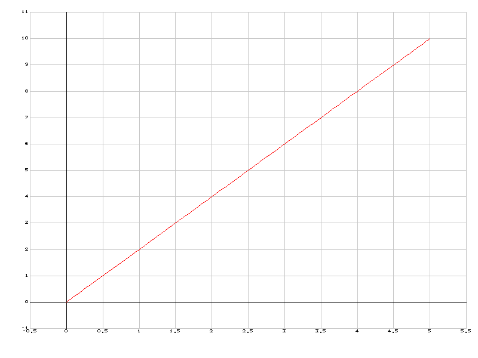
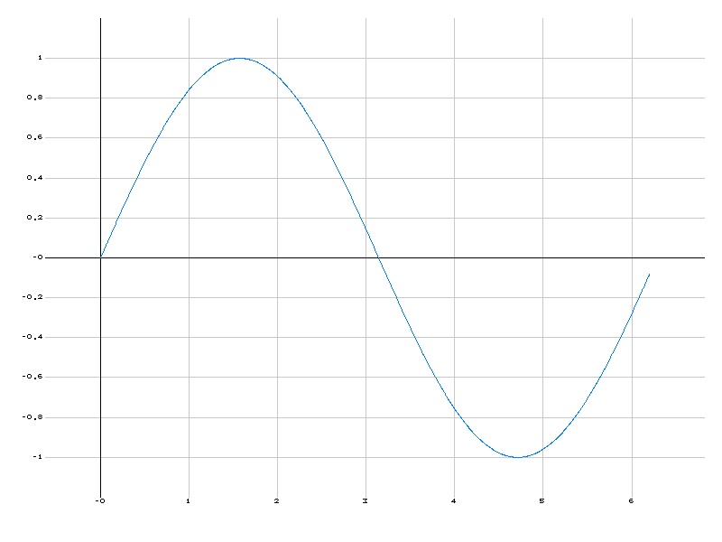
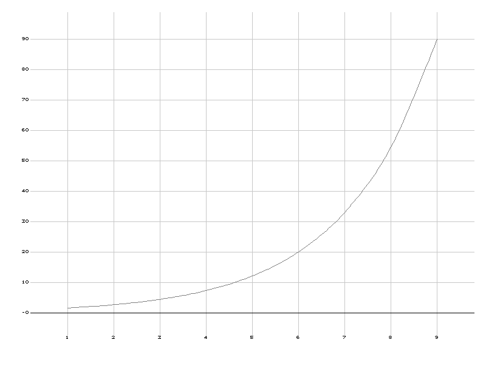
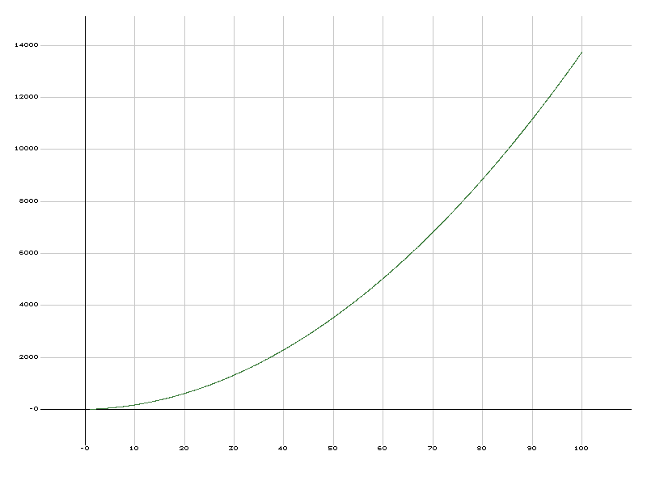
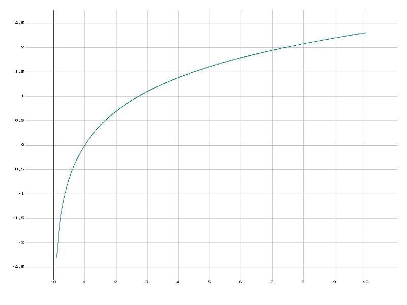
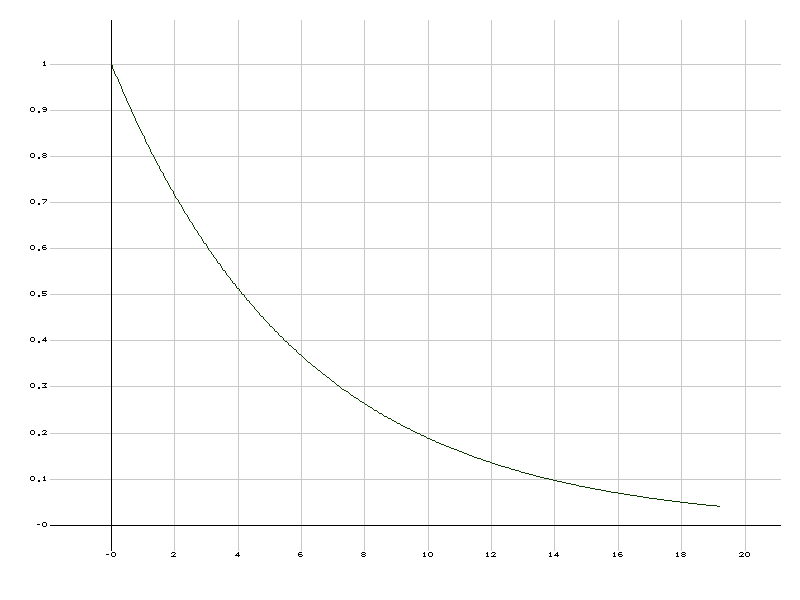
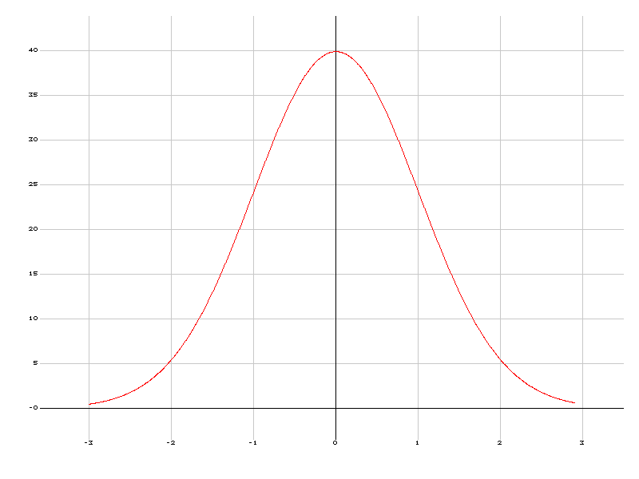
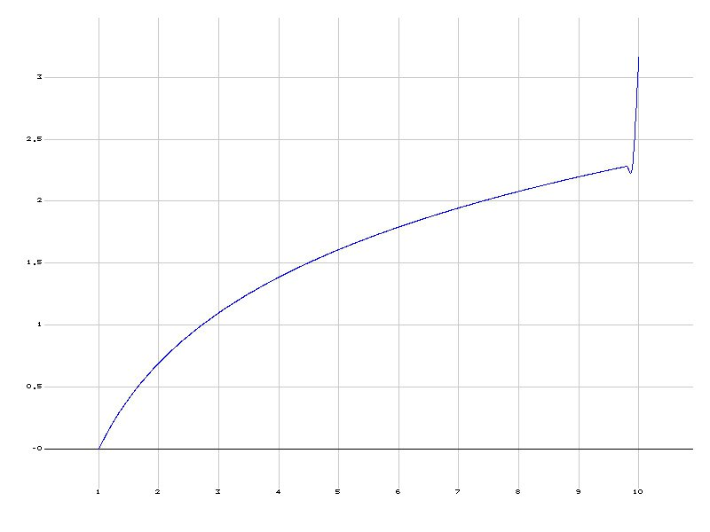

# PlotScript – Interpreter for a Custom Plotting Language

## Student Information
* Katsiaryna Naumovich
* Maksim Dziatkou
* Anton Perakhod

## Contact
* naumovich@student.agh.edu.pl
* mdziatkou@student.agh.edu.pl
* aperakhod@student.agh.edu.pl

## Project Description

### General Goals
The aim of this project is to develop an interpreter for a custom-designed programming language called **PlotScript**. The language is intended for easy generation of 2D plots from both static and dynamic data sources. PlotScript supports mathematical functions, data import from external files, and exporting charts to image formats.

### Target Group
- Students and researchers
- Programmers and data analysts
- Educators
- Business analysts

### Type of Translator
The program is implemented as an **interpreter**, which analyzes and executes PlotScript code at runtime.

### Expected Output of the Program
The PlotScript interpreter can:
- Generate 2D charts from arrays or function expressions,
- Import data from external files,
- Allow embedding of user-defined mathematical functions in C++,
- Export plots to image files (e.g., PNG),
- Support grouped exporting of multiple plots,
- Provide simple customization options (e.g., axis scale, color).

### Implementation Language
The interpreter is implemented in **C++**, using the following tools and libraries:
- `ANTLR 4` for lexer and parser generation,
- `Standard C++ STL` for data handling and execution logic.
- No external graphics libraries are used:
- - Pixel buffer: a 2D vector<vector<Color>> stores RGB for each pixel.
- - Bresenham’s algorithm (drawLine): draws lines pixel by pixel.
- - Catmull–Rom splines: smooth curves by interpolating between data points and drawing small segments.
- - Custom 5×7 bitmap font (font5x7): renders digits and symbols by setting individual pixels.
- - Manual BMP encoder (writeBMP): builds BMP headers and writes the pixel buffer as a 24-bit BMP file.
GUI Application is implemented in Python
   
### Scanner/Parser Implementation
The lexical and syntactic analysis is done using **ANTLR 4**, a powerful parser generator that supports C++ as a target language.

ANTLR-generated C++ code is integrated into the interpreter runtime.

## Token Overview

[antlr4 file with lekser](grammar/PlotScriptLexer.g4)

### PlotScript tokens

| Token               | Opis                                     |
|---------------------|------------------------------------------|
| `TOKEN_PLOT_LBRACKET`     | `'{'`|
| `TOKEN_PLOT_RBRACKET`     | `'}'`|
| `TOKEN_LIST_LBRACKET`     | `'['`|
| `TOKEN_LIST_RBRACKET`     | `']'`|
| `TOKEN_FUNC_CALL_LBRACKET`|`'('`|
| `TOKEN_FUNC_CALL_RBRACKET`| `')'`|
| `TOKEN_BLOCK_DELIMITER`   | `';'`|
| `TOKEN_VALUE_DELIMITER`   | `','`|
| `TOKEN_ASSIGN`            | `':'`|
| `TOKEN_AXIS1`             | `'axis1', 'x', 'X'`|
| `TOKEN_AXIS2`             | `'axis2', 'y', 'Y'`|
| `TOKEN_COLOR`             | `'color'`|
| `TOKEN_OUTPUT`            | `'output'`|
| `TOKEN_ARRANGE`           | `'arrange'`|
| `TOKEN_INPUT`             | `'input'`| 
| `TOKEN_AXIS1_SCALE`       | `'axis1-scale', 'x-scale', 'X-scale'`|
| `TOKEN_AXIS2_SCALE`       | `'axis2-scale', 'y-scale', 'Y-scale'`|
| `TOKEN_FUNC`              | `'func'`|
| `TOKEN_FIRST`             | `'first'`|
| `TOKEN_LAST`              | `'last'`|
| `TOKEN_STEP`              | `'step'`|
| `TOKEN_C_FUNC_START`      | `'$CPP$'`|
| `TOKEN_C_FUNC_END`        | `'$$'`|
| `STRING`                  | `'\'' (Character, SpecialChar)* '\''`|
| `NUMBER`                  | `'-'? Digit+ ('.' Digit+)? 'f'?`|
| `ID`                      | `'[a-zA-Z][a-zA-Z0-9_-]*'`|
| `Character (fragment)`    |  `'Letter, Digit, '_', '-''` |
| `SpecialChar (fragment)`  | `[,.!@#$%^&()+={}'"~]`|


### Embedded C function tokens

| Token                 | Opis                        |
|-----------------------|-----------------------------|
| `C_TOKEN_TYPE_INT`    | `'int'`                     |
| `C_TOKEN_TYPE_DOUBLE` | `'double' \| 'float'`       |
| `C_TOKEN_TYPE_BOOL`   | `'bool'`                    |
| `C_TOKEN_TYPE_VOID`   | `'void'`                    |
| `C_TOKEN_PLUS`        | `'+'`                       |
| `C_TOKEN_MINUS`       | `'-'`                       |
| `C_TOKEN_STAR`        | `'*'`                       |
| `C_TOKEN_DIV`         | `'/'`                       |
| `C_TOKEN_ASSIGN`      | `'='`                       |
| `C_TOKEN_COMMA`       | `','`                       |
| `C_TOKEN_SEMI`        | `';'`                       |
| `C_TOKEN_LPAREN`      | `'('`                       |
| `C_TOKEN_LBRACE`      | `'{'`                       |
| `C_TOKEN_RPAREN`      | `')'`                       |
| `C_TOKEN_RBRACE`      | `'}'`                       |
| `C_TOKEN_IF`          | `'if'`                      |
| `C_TOKEN_ELSE`        | `'else'`                    |
| `C_TOKEN_FOR`         | `'for'`                     |
| `C_TOKEN_WHILE`       | `'while'`                   |
| `C_TOKEN_DO`          | `'do'`                      |
| `C_TOKEN_RETURN`      | `'return'`                  |
| `C_TOKEN_AND`         | `'&&'`                      |
| `C_TOKEN_OR`          | `'\|\|'`                    |
| `C_TOKEN_NOT`         | `'!'`                       |
| `C_TOKEN_GT`          | `'>'`                       |
| `C_TOKEN_LT`          | `'<'`                       |
| `C_TOKEN_GTE`         | `'>='`                      |
| `C_TOKEN_LTE`         | `'<='`                      |
| `C_TOKEN_EQ`          | `'=='`                      |
| `C_TOKEN_NEQ`         | `'!='`                      |
| `C_TOKEN_TRUE_KW`     | `'true'`                    |
| `C_TOKEN_FALSE_KW`    | `'false'`                   |
| `C_TOKEN_SQRT`        | `'sqrt'`                    |
| `C_TOKEN_SIN`         | `'sin'`                     |
| `C_TOKEN_COS`         | `'cos'`                     |
| `C_TOKEN_TAN`         | `'tan'`                     |
| `C_TOKEN_LOG`         | `'log'`                     |
| `C_TOKEN_EXP`         | `'exp'`                     |
| `C_NUMBER`            | `'-'? Digit+ ('.' Digit+)?` |
| `C_ID`                | `[a-zA-Z_][a-zA-Z0-9_]*`    |

## Parser
[antlr4 file with parser](grammar/PlotScriptParser.g4)

## Example PlotScript Code

```plotscript
simple_plot {
    axis1: [0, 1, 2, 3, 4, 5];
    axis2: [0, 2, 4, 6, 8, 10];
    output: 'simple_plot.png';
}
```

```plotscript
sin_wave {
    axis1: arrange(first(0), last(6.28318), step(0.1f)); 
    axis2: func(
        $CPP$
        double f(double x){
            return sin(x);
        }
        $$
    );
    color: [0, 128, 255];
    output: 'sin_wave.png';
}
```

```plotscript
data_from_files {
    axis1: input('X_data.txt');
    axis2: func(
        $CPP$
        double f(double x){
            return exp(x);
        }
        $$
    );
    axis1-scale: 2;
    color: [128, 128, 128];
    output: 'data_plot.png';
}
```

```plotscript
custom_plot {
    axis1: arrange(first(1), last(100));
    axis2: func(
        $CPP$
        double f(double x){
            int b = x * 2 + 6;
            return b*x/1.5;
        }
        $$
    );
    color: [64, 128, 64];
    output: 'custom_plot.png';
}
```

```plotscript
log_plot {
    axis1: arrange(first(0.1), last(10), step(0.1f)); 
    axis2: func(
        $CPP$
        double f(double x){
            return log(x);
        }
        $$
    );
    color: [0, 128, 128];
    output: 'log.png';
}
```

```plotscript
exp_decay {
    axis1: arrange(first(0), last(10), step(0.4f));
    axis2: func(
        $CPP$
        double f(double x){
            double tau = 3.0;
            return exp((-1) * x / tau);
        }
        $$
    );
    color: [10, 55, 0];
    axis1-scale: 2;
    output: 'exp_decay.png';
}
```

```plotscript
gaussian {
    axis1: arrange(first(-3), last(3), step(0.1f));
    axis2: func(
        $CPP$
        double f(double x) {
            double pi = 3.141592653589793;
            return (1.0 / sqrt(2.0 * pi)) * exp(-0.5 * x * x);
        }
        $$
    );
    axis2-scale: 100;
    color: [255, 0, 0];
    output: 'gaussian.png';
}
```

```plotscript
log_condition {
    axis1: arrange(first(1), last(10), step(0.1f));
    axis2: func(
        $CPP$
        double f(double x) {
            if (x < 10.0) {
                return log(x);
            } else {
                return sqrt(x);
            }
        }
        $$
    );
    color: [0, 0, 255];
    output: 'log_condition.png';
}
```


## HOWTO BUILD
### Requirements

1. **CMake** (version 3.15 or higher)
2. **C++ compiler** (Visual Studio on Windows, or an equivalent compiler on other platforms)
3. **vcpkg** (for installing C++ dependencies)
4. **Python 3.x** (preferably 3.7 or higher)
5. **PyQt5** (must be installed into your Python environment)
6. **PyInstaller** (to create a single executable)

### Steps to Build and Package

1. **Create a “build” directory**  
   ```
   mkdir build
   cd build
   ```

2. **Run CMake, pointing to the vcpkg toolchain file**  
   (Assume vcpkg is installed in `C:/tools/vcpkg`. Adjust if your vcpkg resides elsewhere.)  
   ```
   cmake .. ^
     -DCMAKE_TOOLCHAIN_FILE="C:/tools/vcpkg/scripts/buildsystems/vcpkg.cmake"
   ```
   - `..` refers to the repository root (where `CMakeLists.txt` is located).  
   - The `-DCMAKE_TOOLCHAIN_FILE=…` flag tells CMake to use vcpkg for installing any required C++ libraries.

3. **Build the project in Debug configuration**  
   ```
   cmake --build . --config Debug
   ```
   - This step compiles the PlotScript library/executable. When it finishes, you’ll have `PlotScript.exe` (or `PlotScript` on non-Windows platforms) in the `build` folder.

4. **Return to the project root folder**  
   ```
   cd ..
   ```

5. **Install Python dependencies (if not already installed)**  
   ```
   pip install pyqt5 pyinstaller
   ```
   - Ensures that PyQt5 and PyInstaller are available in your Python environment.

6. **Run PyInstaller to package the GUI into a single executable**  
   ```
   pyinstaller --onefile --windowed --add-binary "PlotScript:." gui_plotscript.py
   ```
   Explanation:  
   - `--onefile` produces a single `.exe` (or single self-contained binary on macOS/Linux).  
   - `--windowed` suppresses the console window and builds a GUI-only application.  
   - `--add-binary "PlotScript:."` copies the `PlotScript.exe` (or `PlotScript` binary) into the same folder as the packaged GUI.  
   - At the end of this step, PyInstaller creates a `dist` folder containing `gui_plotscript.exe`.

### Result

After completing steps 1–6, you will have:

```
dist/
└── gui_plotscript.exe
```

- You can place any data files (for example, `data.txt`) side-by-side with `gui_plotscript.exe`.  
- When you call `input('data.txt')` inside the GUI, it will look for `data.txt` in the same folder as the running executable.

### Full Example of All Commands

1. Create the build directory and change into it:  
   ```
   mkdir build
   cd build
   ```

2. Configure with CMake and vcpkg:  
   ```
   cmake .. ^
     -DCMAKE_TOOLCHAIN_FILE="C:/tools/vcpkg/scripts/buildsystems/vcpkg.cmake"
   ```

3. Build in Debug mode:  
   ```
   cmake --build . --config Debug
   ```

4. Return to the project root:  
   ```
   cd ..
   ```

5. (Optional) Install Python dependencies:  
   ```
   pip install pyqt5 pyinstaller
   ```

6. Package the GUI with PyInstaller:  
   ```
   pyinstaller --onefile --windowed --add-binary "PlotScript:." gui_plotscript.py
   ```

After this, you will find:

```
dist/
└── gui_plotscript.exe
```
